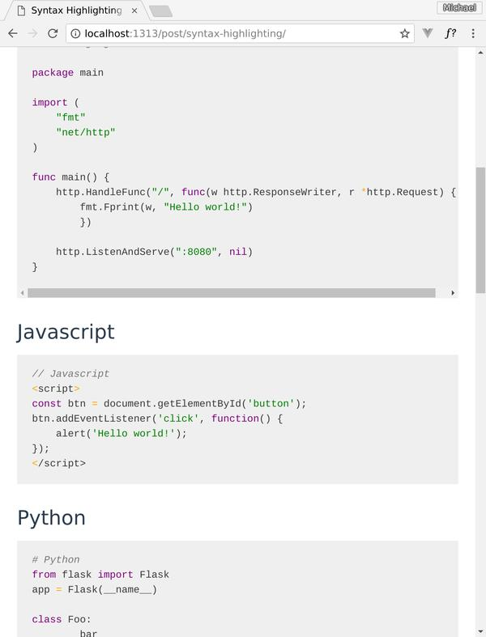

Sass (SCSS) styles enable easy construction of syntax highlighting themes compatible with both:

* [Pygments][], a Python module and utilities used everywhere
* [Chroma][], a Go language package incorporated into the [Hugo][] static site
  generator.

## Acknowledgement

This is a fork of [sass-pygments-theme-base], thanks @MoOx for that work.

## Installation

Clone:

	git clone https://github.com/solutionroute/chroma-sass-themes.git

Or add as submodule within your project's `scss` directory:

	git submodule add https://github.com/solutionroute/chroma-sass-themes.git

Install node-sass:

	cd chroma-sass-themes
	npm install node-sass

Generate pre-defined themes:

	npm run css

## Using a predefined chroma theme

Assuming you've added `chroma-sass-themes` in your project's `scss` directory,
include in your main scss file:

	@import "chrome-sass-themes/scss/taapaca";

## Examples

See `scss/taapaca.scss` and the accompanying screenshot for a minimal but
functional example of the output.



## TODO

* Add sample HTML 

<br>

## WORK IN PROGRESS

This is a new fork as of March 2018; the balance of this README is unchanged since the fork; work in progress.

<hr>

## Usage

In your main Sass file, just define the variable you want. See `my-pygments-theme.scss.sample` as a base. Just uncomment & define variable you need.
By default there is no color defined.
At least define one the color in the first block in the sample :)

Checkout `pygment-theme-freshcut.scss` for an usage example.

### Options

Set variables `$code-base-selector(-*)` to `null` to avoid global & block styles.
Set any variables to null to avoid generated color.

## Live Example

Generate the example ([FreshCut theme](https://github.com/daylerees/colour-schemes#freshcut)): pygments sass base theme highlighed by itself :)

```bash
pygmentize -f html -o example.html _pygments.scss
sass pygments-theme-freshcut.scss example.css
echo "<link rel=\"stylesheet\" href=\"example.css\" /><style>body{-webkit-font-smoothing: antialiased}</style>" | cat - example.html > /tmp/out && mv /tmp/out example.html
```


[Chroma]: https://github.com/alecthomas/chroma
[Pygments]: http://pygments.org/
[sass-pygments-theme-base]: https://github.com/MoOx/sass-pygments-theme-base
[Hugo]: https://gohugo.io/
